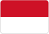
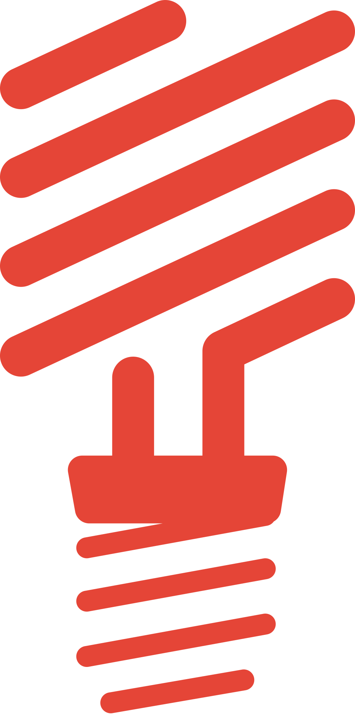
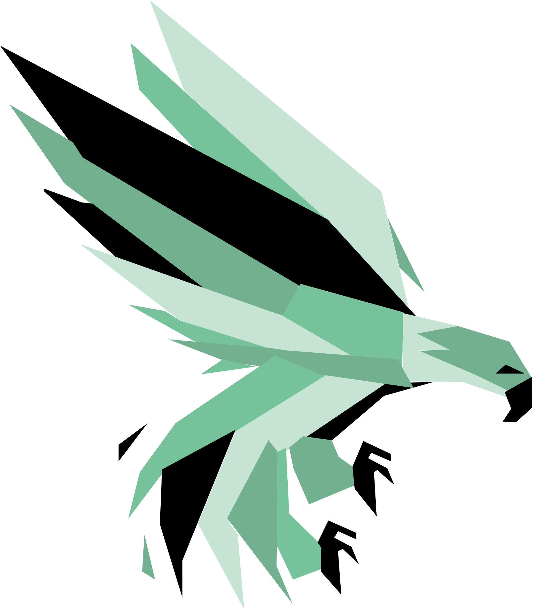
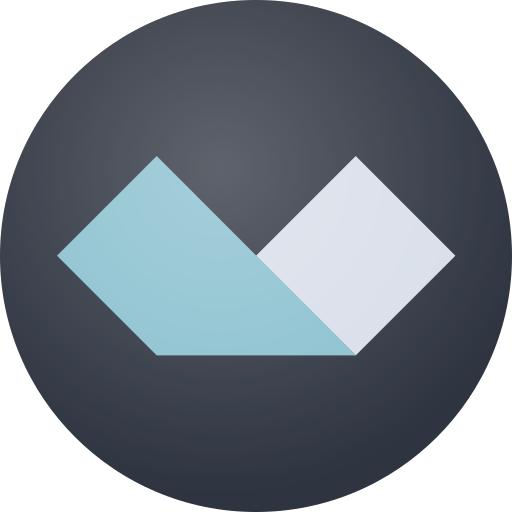
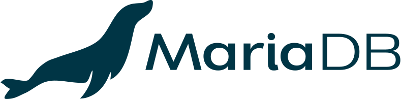

## Hi!  Welcome To My Profile.

&nbsp;

&nbsp;

&nbsp;

&nbsp;

&nbsp;

&nbsp;

 
 

I'm Adi, a Web Developer and Backend Developer from bekasi,  Indonesia. PHP is my first language, after exploring the front & back-end of the web and and now i'm focused on the backend developer

**Languages & Framework:**

&nbsp;

&nbsp;

&nbsp;

&nbsp;

&nbsp;

&nbsp;

&nbsp;

&nbsp;

&nbsp;

&nbsp;

&nbsp;

&nbsp;

 
 

**Databases:**

&nbsp;

&nbsp;

&nbsp;
